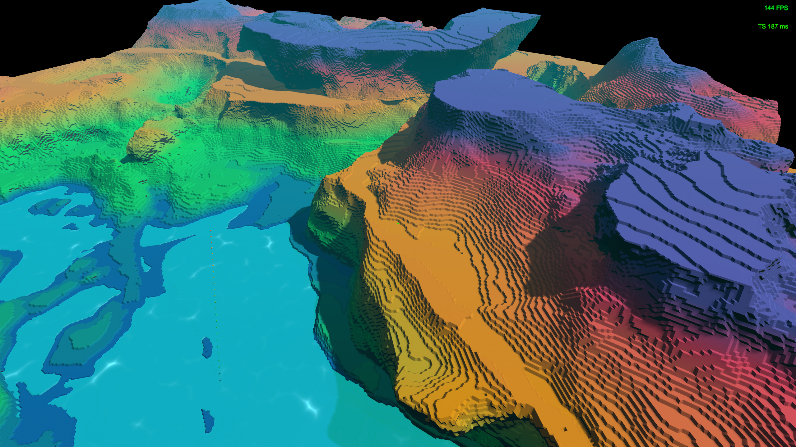

#### Hi I'm Zibo Cao. I am currently a graduate student in Boston. I experiment with Unity engine and web development. ####

## Current Development
Geek Codex

Introducing a dynamic web application designed to showcase and discover creative portfolios! Geek Codex is a vibrant community where users can share and discover their work through simple posts that include an image, summary, and a URL while engaging with others by commenting, liking, and following. Whether it's a blog, GitHub repository, or personal website, our platform serves as a gateway to a world of creativity and innovation. Join us to expose your work to a like-minded audience and explore the endless possibilities of others' creations!

Demo Page

## An attempt at implementing Jos Stam's Stable Fluid (Visualized with VFX particles)

https://user-images.githubusercontent.com/24278214/234157994-1ec84606-d14e-4c0d-8cab-76f015692e71.mp4

## Procedural Animation ##

https://user-images.githubusercontent.com/24278214/230534220-8cedfcb8-28d6-48af-afd0-6db3205355a7.mp4

https://user-images.githubusercontent.com/24278214/230533833-bac64c3f-0da3-49fd-bdc6-a773f34fce35.mp4

## Realtime volumetric rendering with ray marching ##

### Check this out! <a href = https://github.com/FzComet206/Volumetirc-Rendering/blob/master/README.md>  Volumetric Rendering Dev Blog </a> ###

https://user-images.githubusercontent.com/24278214/216487840-55d112b2-dcc6-4319-a852-b059c86c2a53.mp4

https://user-images.githubusercontent.com/24278214/202048267-4c014e95-7553-43c7-8898-4ce0c38588e8.mp4

---
---

## Another hobby project: Project Terraces ##

### Check this out! <a href = https://github.com/FzComet206/Project-Terraces/blob/master/README.md> Project Terrace Dev Blog</a> ###
#

Techniques including: marching cube, 3D noise, fractal brownian motion, domain wrapping, voxal fluid, multiple voxal terrain brush, terracing terrain through noise, some optimizations like chunk culling and procedural generation 

A Smooth Version of the world:

A Blocky Version of the world:

---
---

## An experiment on procedurally generated spherical world and biomes ##

### Check this out! <a href = https://github.com/FzComet206/Spherical-World-Generation/blob/master/README.md> An experiment on procedurally generated spherical world and biomes </a> ###

#

