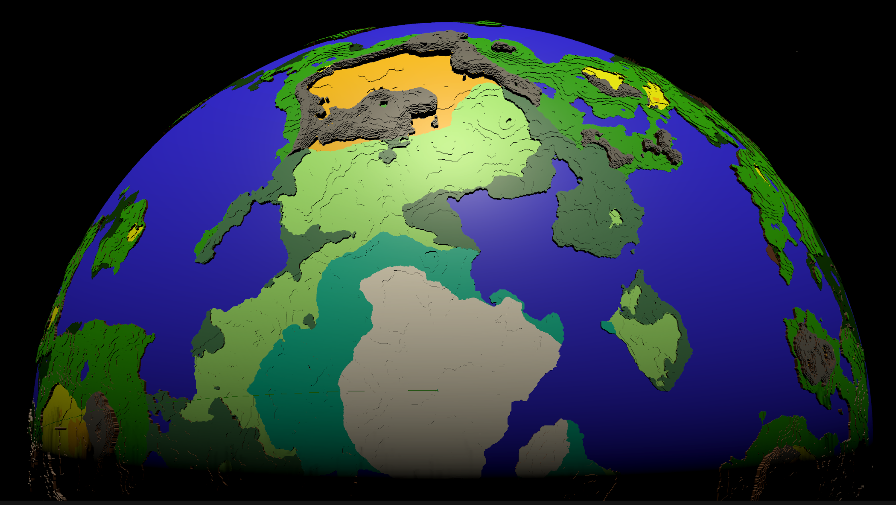

#### Hi I'm Zibo Cao. I am a student in University of Connecticut. I work on some web and Unity projects in my spare time.

Check this out! <a href = https://github.com/FzComet206/Spherical-World-Generation/blob/master/README.md>
An experiment on procedurally generated spherical world and biomes
</a>

#### Another hobby project: Project Terraces ####

Techniques including: marching cube, 3D noise, fractal brownian motion, domain wrapping, voxal fluid, multiple voxal terrain brush, terracing terrain through noise, some optimizations like chunk culling and procedural generation 

<a href = https://github.com/FzComet206/Project-Terraces</a>

